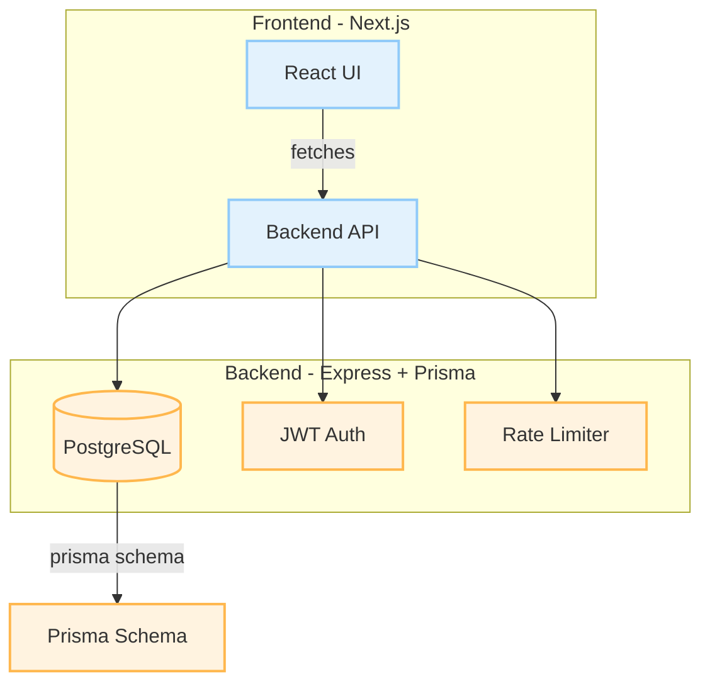

# Cdc Companion

## 📖 Project Overview
**Cdc Companion** is a full‑stack web application that helps CDC (Career Development Center) reviewers and administrators allocate candidates to reviewers based on roll‑number prefixes and profile matching. It consists of a **Next.js** frontend and an **Express/TypeScript** backend with a PostgreSQL database (Prisma ORM).

---

## 🏗️ Architecture

---

## ⚙️ Tech Stack
- **Frontend**: Next.js (React), TypeScript, TailwindCSS (optional), Axios
- **Backend**: Node.js, Express, TypeScript, Prisma ORM, PostgreSQL
- **Auth**: JWT with `isAdmin` claim
- **Rate Limiting**: Custom middleware (`rateLimiter.ts`)
- **Deployment**: Docker (optional), Vercel for frontend, Render/Heroku for backend

---

## 📚 API Endpoints (Backend)
| Method | Path | Description |
|--------|------|-------------|
| `POST` | `/api/auth/login` | Issue JWT token |
| `GET` | `/api/admin/candidates` | List candidates (admin only) |
| `DELETE` | `/api/admin/candidates/:id` | Delete candidate |
| `GET` | `/api/reviewer/allocate` | Allocate reviewers based on roll‑number logic |
| … | … | See `src/controllers` for full list |

---
